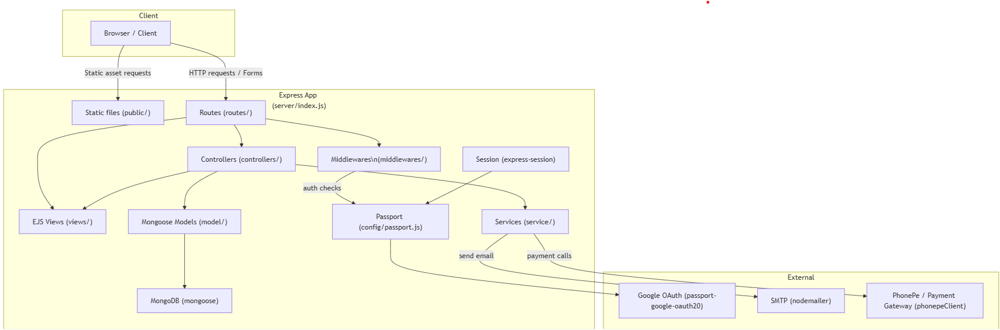

# Verto - Inventory / Warehouse Manager

This repository is a small Express + Mongoose application that provides multi-warehouse inventory management with authentication (local + Google OAuth), product inventory, low-stock reporting, and audit trails and phonePe payment integration. 

IMPORTANT: Since you may not have access to the env file containing credentials required for Google Auth, PhonePe, MongoDB or the mail service, please watch the Loom video I shared — it demonstrates the full project flow.

Loom video: [Watch the demo](https://www.loom.com/share/adf5fdac5b9b4da4a80e2bb585b9fa9b?sid=ac0ad718-120a-4f4d-a833-063da5ce6777)

High level overview of the backend system-



This README explains how to set up and run the project locally and how to use the included Postman collection(s) to exercise the API.

---

## Prerequisites

- Node.js 18+ (tested with Node 20)
- npm or yarn
- MongoDB Atlas (or a local MongoDB instance)
- A Google OAuth 2.0 client (if you want Google login)

---

## Quick start (Windows / PowerShell)

1. Clone the repo and install dependencies

```powershell
cd server
npm install
```

2. Create `.env`

Create a file `server/.env` and add your secrets. Use `server/.env.example` (if present) as a template. Required variables:

```ini
# Google OAuth (optional)
GOOGLE_CLIENT_ID=your-google-client-id
GOOGLE_CLIENT_SECRET=your-google-client-secret


MONGODB_URI=mongodb+srv://<user>:<password>@cluster0.xxxx.mongodb.net/verto

# Mailer (used for password reset emails)
MAIL_SERVICE=Gmail
MAIL_USER=your@mail.com
MAIL_PASS="app-or-smtp-password"
MAIL_FROM=your@mail.com

NODE_ENV=development
```

3. Start the server (development)

```powershell
# from server/ directory
nodemon index.js
# or
node index.js
```

The app listens on port 3000 by default. Open [http://localhost:3000/](http://localhost:3000/) to see the public page.

---

## Routes & Postman

Two Postman collections are included:

- `server/postman_collection_store.json` — small collection for Signup → Login → Store flow (captures cookie `uid` in tests).
- `server/postman_collection_all_routes.json` — full collection of discovered GET/POST routes (import this to explore endpoints).

How to use in Postman

1. Open Postman → File → Import → choose the JSON file above.
2. If you imported `postman_collection_store.json`, its `Signup` request will populate collection variables and its `Login` test extracts the `uid` cookie automatically (look in the collection variables after running Login).
3. For `postman_collection_all_routes.json` you can import and then either:
   - Use the smaller collection first to signup & login and copy the `uid` into the collection variable; or
   - Manually set a collection variable `uid` (the JWT cookie) and add a header `Cookie: uid={{uid}}` to requests that require authentication.

Notes

- Protected routes (under `/home`) require the `uid` cookie (JWT) to be present. Use the Login request to obtain it.
- Some routes accept `format=json` to return JSON instead of a rendered view (e.g. `/home/store?format=json`).


---


## Troubleshooting

- If the server crashes on startup, check the terminal for the exception. Common issues:
  - Invalid `MONGODB_URI` (Atlas connection string needs username/password and network access)
  - Missing `GOOGLE_CLIENT_*` if you attempt to start Google OAuth flows
  - Missing mail credentials if you expect password reset emails (the app will warn and continue without sending in dev)
  - Missing PhonePe credentials if you are trying to buy a product from a store section. 

---

## Server architecture & folder map

The server code follows a small MVC-like structure. Below is a concise map of the important folders and files and what they contain — helpful when explaining the project structure in an interview.

server/

- index.js               # App bootstrap (middleware, sessions, passport, route mounts)
- connect.js             # MongoDB connection helper
- config/
  - passport.js         # Passport strategies (Google/local)
- routes/                # Thin route modules (map URLs -> controllers)
  - root.js             # GET / (public landing)
  - openRouter.js       # Public/open routes
  - user.js             # Login / Signup / Profile routes
  - staticRouter.js     # Auth-protected routes under /home
  - auth.js             # OAuth callbacks and auth helpers
  - payment.js          # Payment endpoints (PhonePe callbacks)
- controllers/           # Business logic (called by routes)
  - user.js
  - cartController.js
  - productController.js
  - paymentController.js
  - warehouseController.js
- model/                 # Mongoose schemas and DB logic
  - user.js
  - products.js
  - warehouse.js
  - cart.js
  - order.js
  - stockAudit.js
- service/               # External integrations & helpers
  - auth.js             # JWT helpers (setUser/getUser)
  - mailer.js           # Email sending wrapper (nodemailer)
  - phonepeClient.js    # PhonePe API client and token handling
- views/                 # EJS templates and shared partials
  - partials/header.ejs
  - partials/footer.ejs
  - homeOpen.ejs        # public home (GET /)
  - home.ejs            # authenticated home (/home)

Notes:

- Routes are intentionally thin; controllers contain most behavior and coordinate models + services.
- Services encapsulate external APIs so they can be mocked in tests.
- The `partials/header.ejs` is used across pages and adapts link targets based on view locals (e.g., `openHome`).


